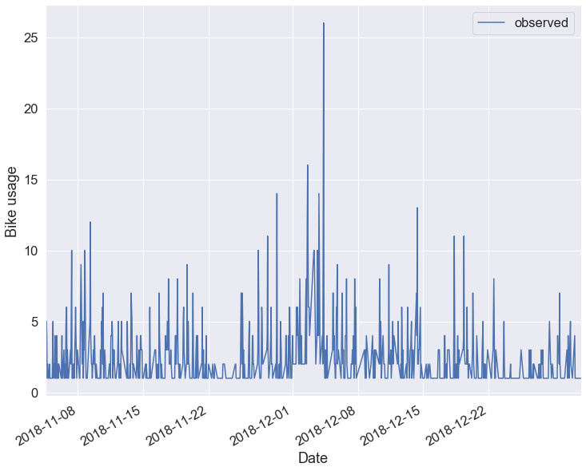
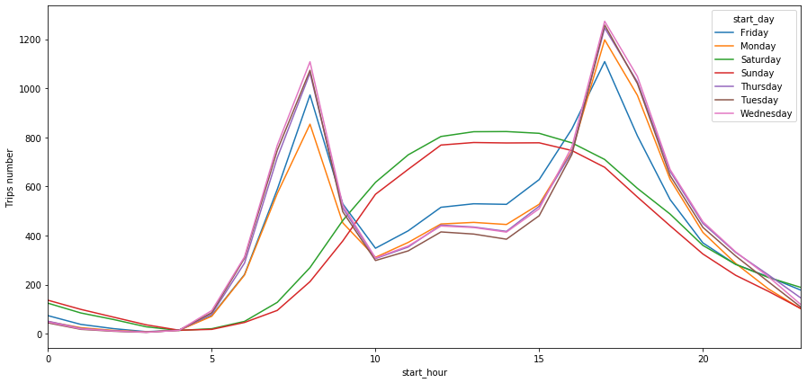
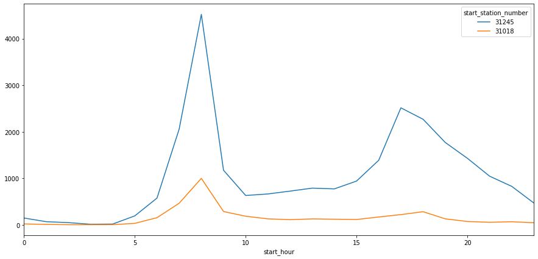
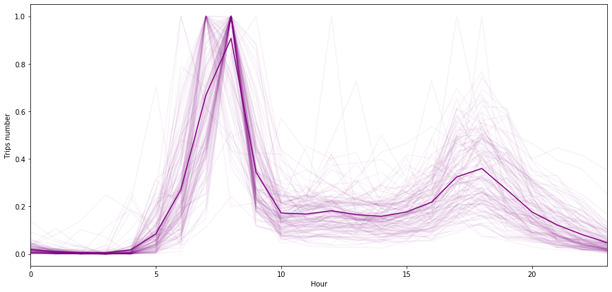
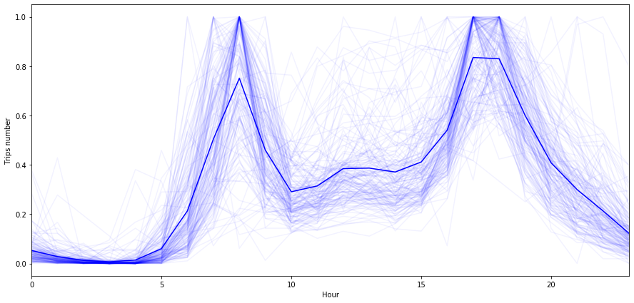
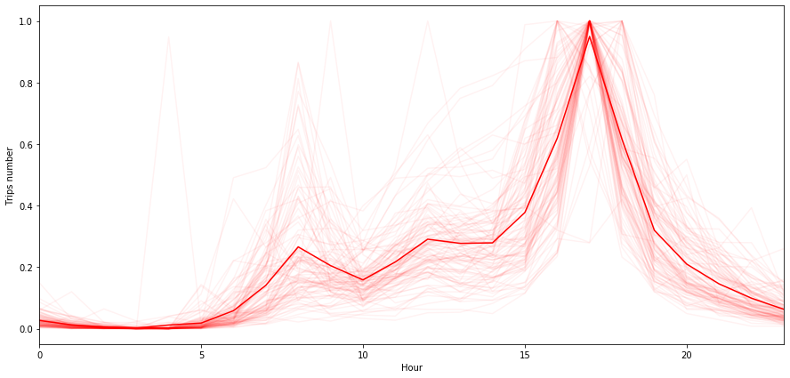

# Project-bikesharing-time-series-clustering

*[Laurent Guerguy]*

## Content
- [Project Description](#project-description)
- [Dataset](#dataset)
- [Results](#results)
- [Links](#links)

## Project Description

The initial goal of this project is to predict the hourly bike usage of a specific bike sharing station in Washington DC. 
After a first analysis it appears that the data for a single station is not sufficient to make a reliable prediction. 
In order to solve this issue the option of clustering the bike station with similar profiles (in terms of bike usage) is explored.
All the results are presented below.

## Dataset
The dataset gives information about the use of the bikesharing system of Washington called Capital Bikeshare for 2017 and 2018. 
The data is obtained from the following link: [Bike share data](https://s3.amazonaws.com/capitalbikeshare-data/index.html).
More data from the bikeshare system of Washington is freely available [here](https://www.capitalbikeshare.com/system-data)
It is composed of 4 quaterly data files for 2017 and 12 monthly files for 2018. They have been combined to create one data set using the code presented in the Data Cleaning notebook enclosed in the repository (within the /project folder).

The data includes:
- Duration – Duration of trip
- Start Date – Includes start date and time
- End Date – Includes end date and time
- Start Station – Includes starting station name and number
- End Station – Includes ending station name and number
- Bike Number – Includes ID number of bike used for the trip
- Member Type – Indicates whether user was a "registered" member (Annual Member, 30-Day Member or Day Key Member) or a "casual" rider (Single Trip, 24-Hour Pass, 3-Day Pass or 5-Day Pass)

This data has been processed by Capital Bikeshare to remove trips that are taken by staff as they service and inspect the system, trips that are taken to/from any of our “test” stations at our warehouses and any trips lasting less than 60 seconds (potentially false starts or users trying to re-dock a bike to ensure it's secure).

## Results

The results first show the problems encountered when trying to predict the hourly bike usage for a specific station. It then explains the implementation of a clustering method in order to solve this issue.

### Hourly bike usage for a specific station

Bike station number 31245 is chosen because it is one of the stations with a large bike usage. The hourly number of bikes taken away from this station is shown on the graph below:

One can see that the hourly traffic is very changing and that the amount of data per hour is not very large. As well there are several hours with no data at all (because no bike has been taken during this hour).
In order to predict the future hourly traffic one needs to have enough data to efficiently train our prediction model.

**One solution to solve this could be to group several stations by their geographical proximity. 
Nevertheless if one wants to extrapolate the prediction of hourly bike usage from a group of stations to one station, one needs to be sure that these stations display the same hourly bike usage profile**

Therefore one needs to answer the following question: is it possible to cluster bike stations as a function of their hourly bike usage profile? This is the question addressed next.

Before performing the clustering let's have a first look at the data available.

### Hourly bike usage during weekdays vs weekend

The average hourly number of bikes taken from all stations is calculated for every day of the week (using the data for 2017-2018). The result is shown on the graph below.

**There is a clear difference between weekdays (Monday to Friday) and the weekend.**

During weekdays the average number of bikes taken has two peaks, one for the morning house-to-work commute and the other one for the evening work-to-house commute. 
During the weekend the number of bikes taken increases steadily during the morning to peak between 12h and 15h then descreases steadily.

### Hypothesis for the station clustering

Towns are usually seperated in various areas:
1. areas where people live and sleep
2. areas where people work (offices areas)
3. mixed areas, a mix of 1. and 2.

Therefore each station could have their own profile of bike usage depending if it is situated in any of these areas.

For example the following bike usage could be expected during weekdays.
In an area where people predominantly live there should be pike of bikes leaving the stations in the morning when people go to work between 7 and 9 am whereas in an area where people work there should be a peak of bikes leaving in the evening between 5 and 7 pm when people go back home. Other stations might have a mixed profile if they are located in areas that are a mix of working and living areas.

Now let's try to cluster the bike stations as a function of these characteristics and see if we can distinguish between these 3 behaviours during weekdays.

### Data preparation before clustering of bike stations

The data used for the clustering modelling is the average hourly average number of bikes leaving a station during weekdays, for each station.

NOTE: The stations with more than two hours of data equal to 0 have been removed from the study because they don't have enough traffic. They are probably stations situated on the outskirts of the city or stations introduced shortly before the end of 2018 and don't have enough data.

But there is another problem that needs to be addressed: not all stations have the same amount of traffic.
As shown in the graph below when comparing stations number 31018 and 31245, the difference in bike usage can be quite large.

**How to make sure that this doesn't affect the clustering process?
To solve this issue it is decided to normalize the data for all stations**

Therefore the clustering will be done using the normalized data.

### Clustering of bike stations

After the normalisation a clustering modelling is performed using the k-means method to try to cluster the bike stations as a function of their bike usage profile.

As mentionned earlier the expected behaviour of the stations on weekdays could fall in three categories:

1. Stations located in a predominantly living area
2. Stations located in a predominantly working area
3. Stations situated in a mixed area, living and working area

**For this reason the chosen number of clusters for the model is 3**

The KMeans method from the Python sklearn library is used and applied with k = 3.
This classifies all stations as part of 3 clusters, number 0, 1 or 2.

For each cluster a graph of the normalized average hourly number of bikes leaving during the weekdays is shown below. 
NOTE: the line in bold represents an hourly average of all the stations in this specific cluster.

For cluster number 0

For cluster number 1

For cluster number 2

The bike stations grouped under cluster number 0 show one clear peak in the morning around 8 am so they are bike stations located in living areas of Washington.
The stations under cluster number 1 show two peaks, one in the morning and the other one in the evening so it accounts for stations situated in areas where there is a mix of living areas and offices or working areas.
Finally the stations under cluster number 3 only present a peak in the evening around 5 pm and correspond to stations located in areas where people work.

**It seems that the k-means model with k = 3 did a good job at categorizing the stations in relevant categories as a function of the bike usage.**

### Next steps

Now that we have shown that we can categorize the bike stations as a function of the profile of bike usage, what would be the next step in the study?

The next step would be to select stations from the same cluster that are located near each other and perform a prediction for the hourly bike usage for this group of stations. Hopefully this should give us enough data to provide a meaningful hourly prediciton in that area. 

## Links

Below is the link to the GitHub repository: 

[Repository](https://github.com/laurent-guerguy/Project-bikesharing-time-series-clustering)  

